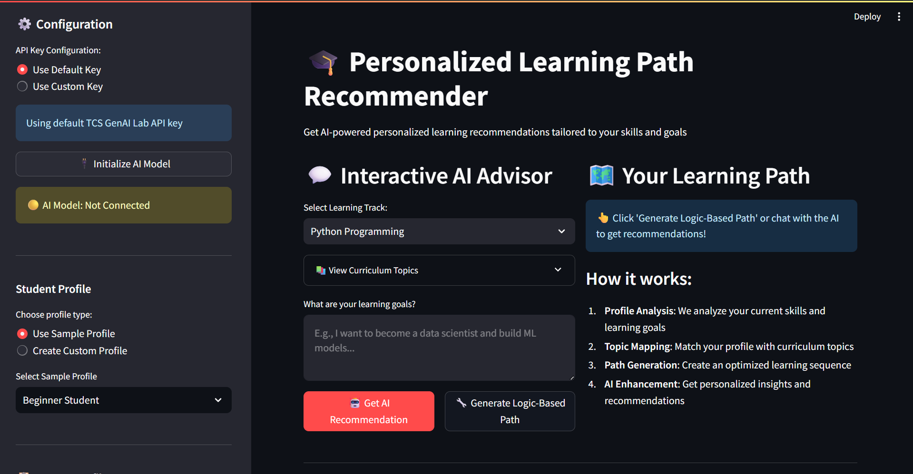

# 🎓 Personalized Learning Path Recommender

An AI-powered educational tool that generates personalized learning paths based on student profiles, career goals, and curriculum requirements.




## 📋 Challenge Overview

Students struggle to identify effective learning paths tailored to their current knowledge and goals. This tool solves that by:

- Analyzing student skill profiles and learning objectives
- Mapping skills to curriculum topics with prerequisite tracking
- Generating personalized learning paths using AI and logic-based algorithms
- Visualizing the learning journey with an interactive UI

## ✨ Key Features

- **Dual Recommendation Modes**: AI-powered (Groq's Llama-3.3-70B) and Logic-based path generation
- **Flexible Profiling**: 3 sample profiles or create custom profiles
- **3 Learning Tracks**: Python Programming, Data Science, Web Development (20+ topics)
- **Visual Learning Path**: Color-coded difficulty levels with prerequisite mapping
- **Export Options**: Download learning paths as JSON

## 🚀 Quick Start

### Installation

```bash
# Clone the repository
git clone https://github.com/hardikjp7/AI-Hackathon.git
cd AI-Hackathon

# Install dependencies
pip install -r requirements.txt

# Run the application
streamlit run app.py
```

### Requirements

```txt
streamlit
groq
pandas
```

### Setup

1. Get a free API key from [Groq Console](https://console.groq.com/keys)
2. Enter the API key in the sidebar when running the app
3. Select or create a student profile
4. Choose a learning track and enter your goals
5. Get AI recommendations or generate a logic-based path

## 💻 Usage

**AI-Powered Mode:**
1. Select learning track (Python/Data Science/Web Development)
2. Describe your learning goals
3. Click "🤖 Get AI Recommendation"

**Logic-Based Mode:**
1. Select learning track
2. Click "🔧 Generate Logic-Based Path"
3. View optimized curriculum sequence

## 📚 Available Learning Tracks

| Track | Topics | Total Duration |
|-------|--------|----------------|
| Python Programming | 7 topics | 23 weeks |
| Data Science | 6 topics | 23 weeks |
| Web Development | 7 topics | 24 weeks |

Each topic includes:
- Prerequisites mapping
- Difficulty level (Beginner/Intermediate/Advanced)
- Estimated duration
- Topic dependencies

## 🔧 How It Works

**AI Mode**: Uses Groq's Llama-3.3-70B to provide conversational, personalized recommendations based on student profile and curriculum.

**Logic Mode**: Applies topological sorting to resolve prerequisites and create an optimized learning sequence based on skill level.


## 🤝 Contributing

Contributions welcome! Please:
1. Fork the repository
2. Create a feature branch
3. Submit a pull request


Made with ❤️ for learners worldwide
